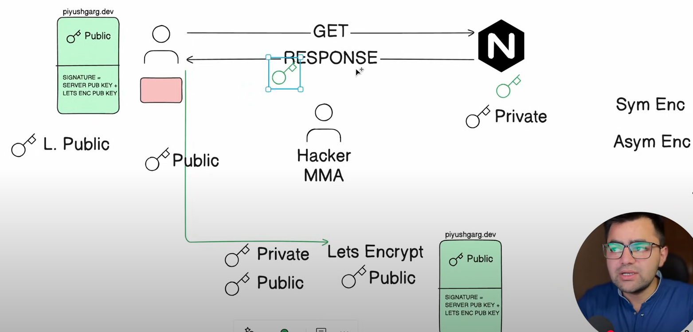
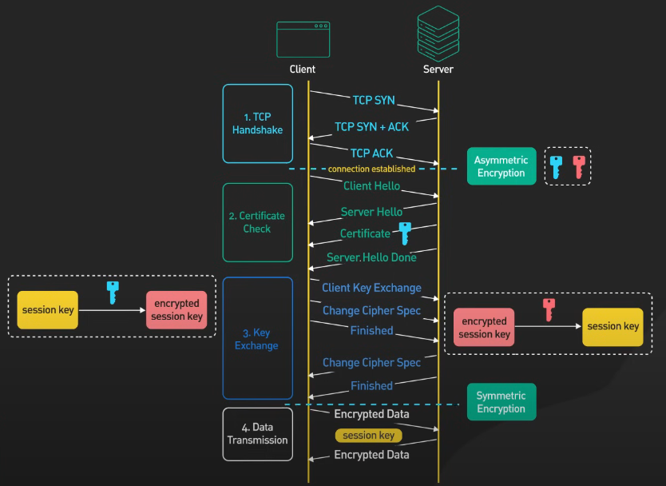
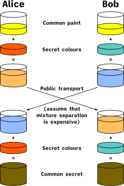
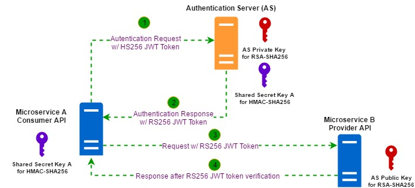

# WEB-SECURITY

## How SSL Works:
Great Video: https://www.youtube.com/watch?v=0yw-z6f7Mb4

## SSL-HTTPS-TLS 
[Source of Information - youtube.com ByteByteGo](https://www.youtube.com/watch?v=j9QmMEWmcfo)

- What is so important about https that these days most websites require it 
- How does https work we'll answer this question in this video
 
Let's Dive Right In without https the communication between the browser and the server is in plain text this means that the password you enter or the credit card number you send over the internet can be read by anyone who has the ability to intercept it  
 
https is designed to solve this problem to make the data sent over the Internet unreadable by anyone other than the sender and the receiver 
https is an extension of the HTTP protocol  
we discussed HTTP in an earlier video check the description it would like to learn more about it  
 
with https data is sending an encrypted form using something called TLS  
TLS stands for <mark>T</mark>ransport <mark>L</mark>ayer <mark>S</mark>ecurity  
If the encrypted data gets intercepted by a hacker all they could see is jumbled data 
Let's take a look at how the TLs handshake works there are several steps 
 

#### Step 1: TCP Connection Establishment 
Just like in the case for HTTP the browser establishes a TCP connection with the server 
 

#### Step 2: TLS Handshake - Hello 
This is where the TLs handshake begins 
The process sends a client hello to the server 
In this Hello message the browser tells the server the following things: 
 - one what TLS version it can support it could be TLS 1.2 TLS 1.3 Etc 
 - two what cyber Suite it supports. A cyber Suite is a set of encryption algorithms to use to encrypt data they're receiving the client hello  
 - the server gets to choose the Cyber suite and the TLs version to use based on the options it got from the client  
 - it sends those in the server Hello message back to the client 
 - the server then sends the certificate to the client the certificate includes a lot of different things  
 - one of the key things is the public key for the server 
 - the client uses the public key in something called `Asymmetric Encryption` 
 - in `Asymmetric Encryption` a piece of data that is encrypted by a public key can only be decrypted by the private key, we'll discuss how this is used in a bit this concludes step two <b>The Hello Phase</b> of the TLs handshake. 

At this point the client has  
- a Server Certificate and  
- the client and server have agreed on the TLs version and  
- the Cyber Suite to use 
 

#### Step 3: Client Key Exchange 
This is the step where the client and the server come up with a share encryption key to use to encrypt data and  
This is where the `Asymmetric Encryption` come into the picture 
Again, with a `Asymmetric Encryption` the data encrypted on the client side using the `public key` from the server can only be decrypted by the server  
This is how the client sends an encryption key safely to the server over the wide open internet 
All this is done in the client key exchange message the exact detail varies depending on the Cyber Suite used 
 
Here we use RSA as an example since it is the easiest to understand  
With RSA the client generates an encryption key also called a `Session Key` encrypts it with the server public key and sends encrypted `Session Key` to the server over the Internet  
The server receives the encrypted `Session Key` and decrypts it with its private key now both sides hold the `Session Key` and  
This is where they enter step 4 of the TLs handshake  
 

#### Step 4:  
They use the `Session Key` and agree upon cyber Suite to send encrypted data back and forth in a secure bi-directional Channel 
Now you may ask why don't we just use `Asymmetric Key` for everything why switch to `Symmetric Encryption` at all 
the main reason is that `Asymmetric Encryption` is computationally expensive  
It is not really suitable for bulk data transmission 

Before we close there are two final points I would like to discuss  
- first the handshake we talked about applied to TLS 1.2 while the latest version is TLS 1.3 and 
TLS 1.3 is supported on all major browsers  
  - as we can see in our illustration TLS 1.2 takes two network round trips to complete 
  - this is one of the major improvements of TLS 1.3 it optimizes the handshake to reduce the number of network round trips to one
  - we decided to talk about TLS 1.2 because we reviewed TLS 1.3 as in optimization as with most optimizations it is a bit harder to explain that's why we chose TLS 1.2 Instead
The Core Concepts in TLS 1.2 still applies to TLS 1.3  
 
- The second final Point we'd like to discuss is that in the explanation above we use RSA for `Asymmetric Encryption` to securely exchange the symmetric `Session Key`  
   Again we chose to RSA because it is easy to understand  
   However `Asymmetric Encryption` is not the only way to share the `Session Key` between the client and the server  
   In fact in TLS 1.3 RSA is no longer supported as the a method for key exchange 
   Diffie-Hellman is a more common way nowadays for exchanging `Session Key` 

   

   Diffie-Hellman  is complicated but in a nutshell it uses some advanced math involving large prime numbers to derive a share `Session Key` without ever transmitting a public key over the network  
 
### Conclusion 
   this is it for https you would like to learn more about system design check out our books and free Weekly Newsletter Please Subscribe you learn something new thank you so much and we'll see you next time 
 

## Overview of Diffie-Hellman Key Exchange
[Source - Wiki](https://en.wikipedia.org/wiki/Diffie%E2%80%93Hellman_key_exchange)

Diffie–Hellman key exchange establishes a shared secret between two parties that can be used for secret communication for exchanging data over a public network. An analogy illustrates the concept of public key exchange by using colors instead of very large numbers:

 - The process begins by having the two parties, Alice and Bob
 - Publicly agree on an arbitrary starting color that does not need to be kept secret. In this example, the color is yellow. 
 - Each person also selects a secret color that they keep to themselves – in this case, red and cyan. 
 - The crucial part of the process is that Alice and Bob each mix their own secret color together with their mutually shared color, resulting in orange-tan and light-blue mixtures respectively, and then publicly exchange the two mixed colors. 
 - Finally, each of them mixes the color they received from the partner with their own private color. The result is a final color mixture (yellow-brown in this case) that is identical to their partner's final color mixture.

If a third party listened to the exchange, they would only know the common color (yellow) and the first mixed colors (orange-tan and light-blue), but it would be very hard for them to find out the final secret color (yellow-brown). Bringing the analogy back to a real-life exchange using large numbers rather than colors, this determination is computationally expensive. It is impossible to compute in a practical amount of time even for modern supercomputers.

### Further read:
[geeksforgeeks - Diffie-Hellman-Algorithm/](https://www.geeksforgeeks.org/implementation-diffie-hellman-algorithm/)

### <mark>Question-1</mark>: What are the different part of web security authentication, authorization, encryption (data at rest, data in transition)?
In web security, the key components are
- <b>Authentication:</b> (verifying a user's identity).
- <b>Authorization:</b> (determining what a user can access once authenticated), and
- <b>Encryption:</b> which can be further divided into
  - <b>"data at rest"</b> (encrypted data stored on a server) and
  - <b>"data in transit"</b> (encrypted data while being transferred across a network),
each with its own specific security measures to protect information from unauthorized access.
#### Authentication:
- Usernames and passwords: Basic method where users provide their credentials to log in.
- Multi-factor authentication (MFA): Requires additional verification like a code sent to a phone besides the password.
- Biometrics: Using physical characteristics like fingerprints or facial recognition for authentication.
- Single Sign-On (SSO): Allows users to log in to multiple applications with a single set of credentials.
#### Authorization:
- Access control lists (ACLs): Define which usens can access specific resources or functionalities within a system.
- Role-based access control (RBAC): Assigns permissions based on a user's role within an organization.
- Attribute-based access control (ABAC): Grants access based on dynamic attributes like location or time.
#### Encryption:
- Data at rest:
    - Full disk encryption: Encrypting entire hard drives where data is stored.
    - Database encryption: Encrypting data within a database.
    - File system encryption: Encrypting individual files on a system.
- Data in transit:
  - Transport Layer Security (TLS): Secure protocol used to encrypt data transmitted over the internet (HTTPS).
  - Secure Shell (SSH): Securely managing remote servers.
  - Virtual Private Networks (VPNs): Creating a secure tunnel for data transmission over a public network.

### <mark> Question-2</mark>: Where CyberArk safe is to be applied in terms of web security, is it Authentication, Authorization, Encryption?
Explanation:
* Authentication:
While CyberArk can be used to manage user login credentials, its primary function is not to handle the initial verification of a user's identity; this is usually done by a separate authentication system.
* Authorization:
The core strength of CyberArk lies in its ability to define granular access controls for privileged accounts stored within its "Safes," ensuring that only authorized users can access specific sensitive data or systems.
* Encryption:
CyberArk does utilize encryption to protect the stored credentials within its vault, but this is a secondary function to the primary focus on authorization and access control.
Key points about CyberArk Safes:
* Storing sensitive credentials:
Safes act as a central repository for storing privileged accounts, including passwords, SSH keys, and API keys.
* Granular access control:
Administrators can define strict policies within each Safe to control who can access which accounts based on their roles and permissions.
* Auditing and reporting:
CyberArk provides detailed logs and reporting capabilities to monitor privileged access activity.

### <mark>Question-3</mark>: What is TLS and mTLS and what is the difference?
TLS stands for Transport Layer Security, a protocol that encrypts data between two communicating parties, primarily authenticating the server to the client;
mTLS (Mutual TLS) is an enhanced version of TLS where both the client and server mutually authenticate each other by presenting their own certificates, providing a higher level of security compared to standard TLS.
Key difference:
* Authentication direction: In TLS, only the server is verified by the client, whereas in mTLS, both the client and server verify each other's identities.
Use cases:
* TLS: Secure web browsing, email communication, VPN connections
* mILS: API security, microservices, loT security, enterprise networks where strict client verification is required.

### Further Read:
 - https://pinggy.io/blog/transport 
layer security vs mutual transport layer security
 - https://www.securew2.com/blog/mutual-tls-mtls-authentication

#### Summary
<b>1. What is Transport Layer Security (TLS)?</b>
* TLS is a cryptographic protocol that secures communication over a network by encrypting data and authenticating the server's identity. It ensures privacy, data integrity, and protection against eavesdropping during transmission.

<b>2. How TLS Works:</b>
 - Step 1: The client sends a message to the server with supported TLS configurations.
 - Step 2: The server responds with its certificate and selected configurations.
 - Step 3: The client validates the server's certificate, and both parties exchange keys to establish an encrypted session.

<b>3. What is Mutual Transport Layer Security (mTLS)?</b>

mTLS builds on TLS by requiring mutual authentication, where both the client and server authenticate each other through digital certificates, ensuring bidirectional trust and enhanced security.

<b>4. How mTLS Works:</b>
 - Step 1: The client proposes configurations and sends its certificate to the server.
 - Step 2: The server responds with its own certificate and selected configurations.
 - Step 3: Both parties validate each other's certificates, and a secure channel is established using a shared session key.

<b>5. Key Differences Between TLS and mTLS:</b>
* Authentication: TLS is one-way (server only); mTLS is two-way (both client and server).
* Security: mTS provides higher security through mutual authentication.
* Complexity: mTS is more complex to implement due to certificate management for both parties.

<b>6. Use Cases:</b>
* TLS: Web browsing, email communication, and VPN connections.
* mILS: APl security, microservices, loT security, and enterprise networks.

<b>7. Pros and Cons:</b>
* TLS: Simple to implement, but does not authenticate the client.
* mTLS: Robust security with mutual authentication, but more complex to manage and implement.

<b>8. Challenges:</b>
* TLS: Managing server certificates and backward compatibility.
* mTLS: Client certificate management and configuration complexity.

## JWT
Great Read : https://asardana.com/2017/05/20/jwt-token-based-authentication/ by [Aman Sardana](https://www.linkedin.com/in/amansardana22/)

### Signature:

### Flow:

Below diagram shows how both the symmetric and asymmetric algorithm can be used together for authenticating the `API consumer` to the `API provider` using the Authentication Server. 

`API consumer` (`microservice A`) generates the `HS256` JWT token using its own shared secret key and sends it over to the authentication server. 

Authentication server validates the `HS256` JWT token using the shared secret key of `microservice A`. 

If the token verification is successful, authentication server generates the `RS256`  JWT token using its own private key and sends it back to `microservice A`. 

`Microservice A` sends the request to `microservice B` with `RS256` JWT token that it got from the authentication server. 

`Microservice B` can authenticate the request from `microservice B` by validating the `RS256` JWT token using the public key of the authentication server. 

Since `microservice A` has already established the trust with the authentication server, `microservice B` can trust the request from `microservice A` if the `RS256` token is successfully validated.

